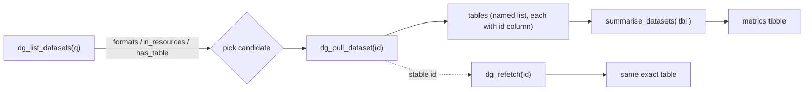

# Design proposal — discovery-first refresh

Reframed primary goal: *let students/data scientists find a dataset matching
their interests, judge whether it is usable, fetch it, and re-fetch the exact
same table reproducibly.*

Current public API: `dg_list_datasets(q, n)`, `dg_pull_dataset(id)`,
`get_summary(x, name)`, `summarise_datasets(datasets, n)`,
`wrapper_datasets(ids, remove_na)`.

## Target flow



---

## Baseline (agreed): stable per-table ID + re-fetch

### 1.1 Composed ID encoding

Each parsed table gets a stable, parseable, globally unique ID:

- Single-file resource: `dataset_id::resource_id`
- File inside a multi-file ZIP: `dataset_id::resource_id::file`

`dataset_id` is a 24-hex ObjectId; `resource_id` is a UUID; `file` is the base
name. `::` is safe as a delimiter (never appears in those fields). This is the
platform's own identity, so it is stable and re-fetchable, unlike filenames.

### 1.2 Store the ID as a column (`dg_pull_dataset`)

Each tibble returned by `dg_pull_dataset()` gains a trailing `id` column
holding the composed ID. Injected in `dg_pull_dataset()` *after*
`read_resource()`/`format_tibble()`, so the low-level parsers stay untouched.

- Non-ZIP: one element, table gets `dataset$id::resource$id`.
- ZIP: one element per file, each gets `dataset$id::resource$id::<file>`.

**Tradeoff to flag:** an `id` column will inflate `n_vars` and skew
`prop_missing` in `get_summary()`. Mitigation: `get_summary()`/`summarise_datasets()`
recognize the metadata column (by reserved name `id`) and exclude it from
`n_vars`, `n_numeric`, `n_non_numeric`, and `prop_missing`.

### 1.3 `dg_refetch(id, remove_na = FALSE)` — new export

```r
dg_refetch(id, remove_na = FALSE)
```

Re-fetch the exact table addressed by a composed ID and return **one tibble**
(the ID addresses a single table, not a multi-file list).

Steps:
1. Split `id` on `::` → `dataset_id` (+ optional `resource_id` + `file`).
2. `fetch_dataset(dataset_id)`.
3. Locate the resource by `resource_id`; error if absent.
4. Read it; if a `file` segment is present, unpack the ZIP and parse **only
   that file** (needs a new `read_one_zip_file(zip, file)` helper); otherwise
   `read_resource(resource)`.
5. `format_tibble(..., remove_na)` and return a single tibble.

Validation: reject malformed IDs (wrong segment count / non-hex dataset id) with
a clear message.

---

## Discovery improvement 1: usable-at-a-glance search

`dg_list_datasets()` currently keeps only title/id/description/slug and
**discards `resources`**, so students can't tell whether a hit holds a real
table. Fix: keep the `resources` metadata and derive a compact availability
summary.

New columns on the returned tibble:

- `n_resources` — number of resources (integer; `0` when none).
- `formats` — comma-joined, de-duplicated, uppercase formats of the dataset's
  resources, e.g. `"CSV, ZIP"`, or `"—"` when none. (Reuse `supported_formats()`.)
- `has_table` — logical: `TRUE` if any resource is directly parseable (non-ZIP
  supported format). A ZIP is a *maybe*, so it is shown under `formats` but does
  not by itself set `has_table`.

Adding these makes `dg_list_datasets(q = "vélo", n = 20)` immediately answer
"which of these can I actually open?" before spending a download.

Note: `fetch_datasets_page` currently requests `format = c("csv","xlsx","tsv","txt")`
— the search is already biased to tabular formats, but the resource-level
formats are still worth surfacing.

## Discovery improvement 2: summarise a search result set

Close the preview loop so students can see rows/variables/missingness across
all matching datasets.

**`summarise_datasets()` gains an accepted input:** a data-frame returned by
`dg_list_datasets()` (recognized by its `id` column, which is already present).
Then `summarise_datasets(dg_list_datasets(q = "vélo"))` pulls and summarizes
every hit in one call. Character-vector and named-list inputs keep working.

This complements (rather than replaces) the existing `NULL`/default behaviour.

---

## Optional / low priority

- **Rename `wrapper_datasets()`** — the name is vague for an educational
  package. Option: rename to `dg_download_many()` or fold its behaviour into
  `summarise_datasets()` so there is a single "download & summarize" entry
  point. Decide whether churn is worth it.
- **`dg_pull_dataset()` accepting a search term** — convenience alternative to
  `dg_list_datasets(q) |> ...`; only if we want the pull to own search.

---

## Main API vs tabular API: division of labour

Answering "is the main API even useful if the tabular API also serves the
data?": **yes — the main API is the backbone; the tabular API is a
variable-metadata supplement.** They are not substitutes.

| Concern | Main API (`www.data.gouv.fr/api/1`) | Tabular API (`tabular-api.data.gouv.fr`) |
|---------|-------------------------------------|------------------------------------------|
| **Keyword search over the catalog** | ✅ `dg_list_datasets(q)` server-side search | ❌ keyed only by resource UUID; no catalog search |
| **Discovery metadata** (title, org, license, frequency, temporal/spatial, description, formats, sizes) | ✅ | ❌ only `dataset_id` link + table profile |
| **Per-column info** (types, formats, stats) | ❌ absent from payloads | ✅ `/resources/{rid}/profile/` + `/swagger/` |
| **Serving the table** | raw file URLs (`static.data.gouv.fr`) | ✅ `/resources/{rid}/data(.csv|.json)/` with filter/paginate/sort |
| **Coverage** | every resource on the platform | only resources indexed by the tabular service (unindexed → **404**) |
| **Non-CSV support** | ✅ own parsing (TSV, TXT, XLSX, JSON, ZIP) | CSV-oriented pipeline |

Implications for this package:

- `dg_list_datasets(q)` remains irreplaceable: the tabular API has no keyword
  search, and discovery metadata (is this dataset about my interest?) comes
  only from the main API. The educational core rests on the main API.
- The pull path (`read_resource`) keeps downloading raw files itself. That
  preserves full format/coverage (xlsx, json, zip; resources the tabular
  service hasn't indexed), which the tabular API cannot guarantee.
- The tabular API's unique value is **variable metadata at pull time**, which
  the main API lacks. Use it as a *supplement* only: when a resource is
  served by the tabular service, `/profile/` (and optionally `/swagger/`)
  gives column names/types/formats + row count before the user commits to a
  full download. When it 404s, fall back gracefully (no column profile).
- Keying lines up with the ID design: the tabular API is addressed by
  `resource$id` (a UUID), and its profile carries `dataset_id`, so a composed
  table ID maps straight onto a `<dataset_id>::<resource_id>(::<file>)` address.

---

## New phase: variable/profile pull (via tabular API)

`dg_schema(id)` — best-effort column profile for a single table address.

- Input: a composed table ID (same format as `dg_refetch`), or a raw
  resource UUID.
- Implementation: hit `https://tabular-api.data.gouv.fr/api/resources/{rid}/profile/`
  (using the resource UUID extracted from the ID), map its `columns_fields`
  into a tibble of `column`, `type`, `format`, `score`, plus `total_lines`,
  `encoding`, `separator`.
- Returns `NULL` (with a message) when the resource is not served by the
  tabular API (404), and errors on a malformed ID.

---

## File-level change map

| File | Change |
|------|--------|
| `R/utils.R` | `read_zip_resource()` unchanged; add `read_one_zip_file(zip, file)`; add an `id`-composition helper (e.g. `compose_resource_id()` / `parse_resource_id()`). |
| `R/dg-pull-dataset.R` | `dg_pull_dataset()` injects `id` column per table. |
| `R/core-functions.R` | `get_summary()` excludes the `id` metadata column; `summarise_datasets()` accepts a `dg_list_datasets()` tibble. |
| `R/dg-list-datasets.R` | Add `n_resources`, `formats`, `has_table` columns. |
| `R/dg-refetch.R` (new) | `dg_refetch()` + validation. |
| `R/dg-schema.R` (new) | `dg_schema()` via tabular API `/profile/` with 404 fallback. |
| `R/datagouv-package.R` / NAMESPACE | Document/export the new function. |
| `tests/` | Unit + snapshot tests for each change. |
| `README.qmd` | Update flow examples; rebuild README. |

---

## Phasing

1. **Baseline only** *(implemented)*: ID column + `dg_refetch()` + `wrapper_datasets()` ->
   `dg_download_many()` rename + metrics exclusion + tests.
2. **Search surfacing** *(implemented)*: `dg_list_datasets()` availability columns + tests.
3. **Preview loop** *(implemented)*: `summarise_datasets()` accepts a list-datasets tibble + tests.
4. **Column profile** *(implemented)*: `dg_schema(id)` via the tabular API `/profile/`, with
   404 fallback + tests.
5. (Optional) convenience tweaks.
